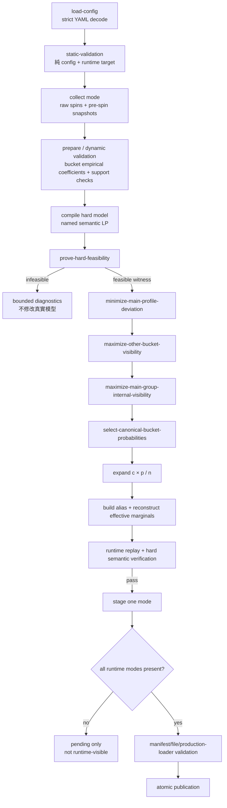

# Problab Math Intent Optimizer v2：設計意圖、約束與實作知識

> 文件性質：現行設計知識與實作對照基準  
> 適用範圍：`cmd/opt`、`optimizer/v2`、`opt_cfg.yaml`  
> 實作基線：`intent-lp-v2.3.1`  
> 最後核對：2026-08-28

> **先說結論：v2 之所以做成一個龐大而不討巧的工程，是因為我們拒絕再拿 optimizer 的方便交換設計意圖的真實性。配置檔應記錄設計師知道、想要、拒絕與刻意不知道的事情，而不是記錄「為了讓某種公式終於產生解，我們最後把哪些參數調成了多少」。**

這份文件回答五個問題：

1. 舊路線真正造成了什麼實務痛點，為什麼不是換一個 solver 就能解決？
2. Problab v2 到底在解什麼設計問題，並拒絕替設計師假設什麼？
3. 一條條條件從哪個 YAML 欄位、收集結果或系統語意而來？
4. 哪些是會拒絕結果的強條件，哪些只是有優先順序、允許偏離的弱條件？
5. 一個沒有讀過 Problab 的 AI，如何依照目前實作檢查配置、解讀風險並比對程式？

---

## 1. 我們到底在做什麼？

### 1.1 真正的痛點：最後的配置到底在描述誰？

任何 optimizer 的配置都應先接受一個殘酷但必要的問題：

> 最後留下來的配置，是設計師對玩家體驗的描述，還是設計師、數學家與 optimizer 為了讓某個生成方法跑得動，反覆妥協後留下的參數考古？

這不是文字潔癖，而是產品可解釋性的根本。若一份配置充滿 Gaussian mean、sigma、mixture count、tail bias、penalty coefficient、acceptance threshold，而設計師只能說「這樣調比較容易找到解」，那麼配置已經不再是設計意圖。它描述的是方法的胃口。

可用一個簡單的反事實測試判斷：

> 假設明天完全更換 optimizer，設計師是否仍能只用玩家會感受到什麼，逐項解釋這個欄位為什麼存在、這個值為什麼不能隨便改？

- 若能，這很可能是設計契約；
- 若只能用某個 solver、曲線或 fitness 的行為解釋，這更像 execution knob；
- 若連設計師與數學家都不知道改動後的玩家體驗，只知道「會比較容易收斂」，它就不應偽裝成 Designer intent。

v2 的第一個產品決定因此不是 LP，而是**把設計意圖的所有權拿回來**：Designer YAML 必須盡可能保存設計師真正想說的話；solver 應配合這份契約工作，而不是讓契約配合 solver 的習性變形。

### 1.2 舊路線的隱含前提：先相信連續，再尋找最優

Gaussian、Gamma、平滑曲線或與 prior 的距離，本身都是合法數學工具。真正的問題是：當它們被當成預設搜尋空間時，我們其實在求解之前就偷偷加入了一個巨大假設：

> payout 數軸上的連續距離，足以近似玩家體驗的距離；一條平滑、連續或接近 prior 的分布，也因此更可能帶來好的玩家體驗。

這個假設通常沒有被證明，而且在 slot 體驗中經常不成立。

玩家不會覺得 `302.1x` 與 `302.2x` 的機率差異，必然比下列因素更重要：

- 他為什麼拿到這個倍數；
- 是普通 line win、特殊 symbol、feature trigger 還是 free game 結算；
- 畫面、聲音、節奏與揭示過程如何呈現；
- 某些倍數以上的獎項在有限遊玩歷程中是否經常出現；
- 同樣倍數區段是否由足夠不同的 replay outcomes 構成；

反過來，數值上很接近的 49.9x 與 50x 可能跨越動畫或 BigWin 語意；數值相同的 base-game win 與 bonus outcome 也可能完全不是同一種體驗。

因此「payout 軸距離」不等於「玩家體驗距離」。若一開始就把前者當成後者，後續 optimizer 即使數學上完美，也只是在錯誤座標系裡找到最優。

### 1.3 預設常態／連續 shape 的實務傷害：大片近零的靜默區

連續 shape 最常見、也最容易被圖表掩蓋的問題，是在理論 support 與玩家實際可見性之間製造大片靜默區。

例如一個或數個 Gaussian modes 可能在中心附近分配大量 probability，而在兩個 modes 之間、遠離均值的 tail，或 payout support 不均勻的區域留下極小質量。圖上看起來仍是一條完整、平滑、處處大於零的曲線；但落到有限局玩家體驗與離散 replay atoms 後，這些區域可能近似永遠不會出現。

這個問題有幾層：

1. **數學非零不等於體驗可見**：`1e-9` 不是零，但對玩家有限的體驗次數幾乎就是沉默。
2. **平滑圖形會掩蓋離散 support**：曲線經過某區域，不代表該區域有足夠且多樣的可重播 outcomes。
3. **projection 會保存錯誤 prior 的沉默**：若 objective 是「盡量接近 prior」，prior 的近零區會被當成值得保存的特徵。
4. **extreme-point selection 會把未保護區域直接歸零**：即使不用 Gaussian，只給 hard LP 而沒有 visibility semantics，也可能選出大量 zero buckets。
5. **設計師很難指出問題來源**：他只看到某些體驗很久沒出現，卻無法從 sigma、mixture weight 或 aggregate fitness 反推是哪個意圖被犧牲。

因此 v2 不把「處處有一點數學密度」當成多樣性，也不把「曲線平滑」當成體驗連續。它直接詢問有產品意義的問題：這個語意區域是不是 Main？總量應有多少？未被指定為 Main、但確實有 support 的區域，最低能見度能保存多少？一個 Main Group 內有多個 supported siblings 時，是否只是因 tie-break 而把其中一些抹成零？

### 1.4 難以解釋設計意圖：abstraction leakage

舊方法要求設計師或數學家把體驗語言翻譯成生成器語言，例如：

```text
玩家應經常感受到這個體驗群
  -> 增加某個 Gaussian amplitude？

這一段要有多樣性
  -> 增加 sigma？增加 mixture 數？降低 smoothness penalty？

高倍記憶點不能消失
  -> tail bias？range multiplier？fitness bonus？
```

問題是這個翻譯通常沒有可靠逆映射：

- sigma 變大不等於玩家感受到更多有意義的多樣性；
- tail 加重不等於某個記憶點更清楚；
- fitness 從 0.82 升到 0.86，不代表更忠於設計師原本那句話；
- 同一組 shape parameters 在不同 empirical support 上可能產生完全不同的實際 artifact；
- solver 跑出的曲線往往連數學家也只能描述其統計外觀，不能說明玩家為什麼應喜歡它。

這就是 abstraction leakage：設計師被迫理解 optimizer 的抽象，但 optimizer 沒有忠實保存設計師的抽象。最後留下的設定愈來愈像「我們發現這些 knobs 能跑」，而不是「玩家應得到這些體驗」。

### 1.5 「默默放寬條件」有兩種，而且都會失去原意

第一種是**系統替人放寬**：

- solve 不出來就加 tolerance；
- 自動擴大 mean/CV/Main ranges；
- 合併 empty 或 inconvenient buckets；
- 降低 sample/support 要求；
- 換 seed、重跑 random search 直到碰巧通過；
- 用 penalty 取代原本真正會拒絕的條件。

第二種更隱蔽，是**人被工具逼著自我放寬**：

- 因 optimizer 一直找不到，設計師只好反覆調 sigma、bias、curve ratio；
- 為了收斂，把原本重要的範圍寫寬；
- 因不知道衝突在哪裡，只能一次拿掉一個條件試跑；
- 最後得到一份「能跑」的配置，卻已無法回答它和最初體驗構想差了多少。

兩者的結果相同：原始意圖消失在調參歷史裡。成功只代表某個方法終於產生輸出，不代表產品接受的條件真的被滿足。

v2 對此採取刻意強硬的契約：

- hard 無解就回 `INFEASIBLE_*` 與證據；
- 不自動改 YAML、boundary、support 或 seed；
- soft 才能偏離，而且偏離必須用 `delta` / `rho` 明確量化；
- numerical failure、support failure與 mathematical infeasibility 必須分開；
- 若 Designer 看過診斷後決定修改配置，那是一次有意識、可 review、可 version-control 的設計決策，不是 optimizer 的暗中副作用。

### 1.6 錯誤的路線很難找到正確答案

我們承認不知道什麼是唯一最好，但不能因此隨便選一個容易生成的 shape，再把該 shape 的 optimum 稱為最好。

「不知道最優」和「任何 prior 都一樣合理」不是同一句話。若先假設玩家體驗主要由連續 payout shape 決定，再尋找這個 shape 中的 optimum，我們找到的最多是：

> 在一個未經證實、甚至可能錯誤的體驗模型裡，對該模型而言最好的答案。

一個方法能產生解，只證明它在自己的假設下可運算；它不證明那些假設正確。一條錯誤的路線和錯誤的初衷，通常不會因為 optimizer 更快、更精確或 sample 更多，就自然抵達正確答案。

因此 v2 選擇先縮小自己的主張：不聲稱知道完整玩家效用函數；只忠實表達已知的設計結構，證明它們能否共存，並把不知道的維度留給後續證據或 evaluator。

### 1.7 v2 的認知契約：知道、不知道、想要、不想要

v2 的設定語言不只記錄數字，也記錄知識邊界：

| 設計師的認知／意圖 | v2 表達方式 | 系統承諾 |
|---|---|---|
| 知道且不接受違反 | exact mean、median range、CV range、Main total、risk 等 hard intent | 有解才產出；無解明確拒絕 |
| 知道方向，但接受數學衝突時有限偏離 | Main Groups 的 relative `prefer` | 以第一順位 soft optimization 最小化並量化 `delta` |
| 明確不想要 | mismatch tags、upper bounds、Main maximum、collision cap 等 | 編譯成排除或 hard upper condition |
| 知道一整個區域重要，但不知道區域內怎麼分 | 跨 atomic buckets 的 Main Group | hard 只限制 Group total，不發明內部 prior |
| 沒有設計某些 supported Others 的 shape，但不希望它們任意消失 | 不新增 Designer target；使用 neutral Other visibility | 只最大化最低可見度並報告 `rho_other` |
| 不知道 Main siblings 的最佳 split，但不希望 canonicalization 任意抹零 | neutral Main internal visibility | 只加入 supported-sibling floor並報告 `rho_main` |
| 不知道 hard + intent space 中哪個點最好玩 | 保留自由度與 outer-evaluator boundary | canonical 只作穩定代表點，不宣稱體驗最優 |
| 只是工程怎麼跑 | workers、seed、tolerances、probe counts | 與 Designer-owned MathIntent 分離並完整記錄 provenance |

「沒有指定」必須真的保留成沒有指定，不能在 compiler 中偷偷補成 Gaussian、uniform 或 smooth。另一方面，「不知道最佳 split」也不等於接受 supported regions 因數學 tie-break 毫無語意地消失，所以 visibility 被明確標成較弱的 `SystemNeutralPreference`，不能冒充 Designer authoring。

### 1.8 最終配置究竟是忠實意圖，還是對公式的妥協？

v2 的正式答案是：

> **配置檔應是盡可能忠實、可由設計師逐項解釋的意圖契約；它不應先為公式、生成器或求解方法妥協。模型與求解流程的責任，是忠實編譯這份契約並說明可行性與代價。**

這不表示配置完全沒有 abstraction。Class、bucket、Group、mean、median、CV 本身仍是刻意選擇的設計模型；但每一層都必須：

- 可用玩家體驗或明確數學風險解釋；
- 在 YAML 中看得到；
- 知道是 hard、Designer soft、system-neutral 還是 execution option；
- 能追到 constraint、report 與 artifact；
- 不因 backend 換掉就失去語意。

真正的妥協只允許發生在三個公開位置：

1. **Designer 明寫為 soft 的 Main profile**：偏離以 `delta` 量化；
2. **系統中立的 visibility**：能保存多少以 `rho_other` / `rho_main` 量化；
3. **Designer 看過 infeasibility evidence 後主動修改版本化配置**：這是新的設計決定，不是舊配置被暗中扭曲。

Hard intent 不以「差不多」成功。若 hard 無解，正確產品結果就是無解與診斷，而不是一個悄悄背叛配置的 artifact。

### 1.9 為什麼 v2 是一個很大的工程？

若目標只是產生一組看起來合理、RTP 大致正確的 weights，Gaussian generation、random screening 或單一 weighted objective 都更短、更便宜，也更容易展示。

v2 之所以吃力不討好，是因為真正要交付的是**可相信的語意邊界**：

- strict schema，避免拼字或缺值默默變成預設；
- Class/tags/buckets，保留離散體驗與 presentation semantics 的入口；
- 真實 game logic outcome collection，而非虛構連續 support；
- empirical mean、second moment、CDF 與 replay identity；
- named hard rows與明確 constraint origins；
- hard feasibility 與 soft feasibility 的不同 status policy；
- 多次有界 LP probes，保留 lexicographic intent priority；
- support、model、numerical failure 的分層 diagnostics；
- 不依賴 backend basis 的 canonicalization；
- alias effective marginal reconstruction；
- 每個 snapshot 的 runtime replay；
- 完整 artifact validation與 atomic publication。

這些工作對「求一個數學解」多半不是必要的；對「證明我們沒有在不知不覺中改掉設計師說的話」卻是必要的。v2 的工程成本正是產品立場的成本。

### 1.10 v2 不是反對連續數學，而是反對未聲明的體驗假設

若未來有實證證明某個 Class 的玩家效用確實適合連續距離、smoothness 或特定 prior，這些都可以作為**顯式、可選、可報告**的 Designer preference 或 outer evaluator 加入。

v2 拒絕的是：

- 因為某種曲線容易生成，就默認它比較好；
- 因為某個 objective 容易求解，就把它當成玩家效用；
- 因為 config 能跑，就認為它保存了設計意圖；
- 因為數學密度非零，就認為玩家一定看得到；
- 因為 solver 回 optimal，就跳過 runtime artifact 的真實性。

目前系統因此必須區分：

1. **合法性**：hard constraints 是否同時可行；
2. **意圖保存程度**：Main profile 與 visibility soft preferences 能保存多少；
3. **玩家體驗最優性**：目前不宣稱，留給未來可選的外層 evaluator。

目前 `candidate_selection.evaluator` 只能是 `none`，系統只產生一個 deterministic canonical representative，並明確報告 `player_experience_optimality: NOT_CLAIMED`。

### 1.11 v2 的最重要邊界

本系統遵守以下邊界：

- hard conflict 就拒絕，不自動放寬、不改 YAML、不換 seed 重抽到碰巧成功；
- soft preference 可偏離，但必須量化可達程度；
- Main Group 的 hard 語意只指定 Group total；不推斷內部 Gaussian、uniform 或任何 prior；
- visibility 只加入最低存在感，不冒充 Designer intent；
- LP 定義 `hard + locked intent` feasible space；未來黑盒 evaluator 可在其中選解，不要求把玩家體驗 objective 線性化；
- 最終 runtime alias distribution 才是 artifact truth，solver vector 本身不是發布完成的證明。

---

## 2. 強度、來源與失敗語意

後文使用以下分類。

| 類別 | 意義 | 衝突時行為 | 典型來源 |
|---|---|---|---|
| Static hard | 不需樣本即可判斷的 schema / semantic contract | `INFEASIBLE_CONFIG` | YAML、版本、欄位關係 |
| Support hard | 收集後，針對本次 replay support 可直接判斷的必要條件 | `INFEASIBLE_SUPPORT` | outcome、snapshot、empirical stats |
| Model hard | LP 必須同時滿足的不可放寬條件 | `INFEASIBLE_MODEL` | Designer hard + system invariant + derived guardrail |
| Strong soft | 優先保存的 Designer preference | 不使 Run infeasible；以最佳可行 `delta` 鎖定 | `main_experience.prefer` |
| Weak soft | 系統中立的 anti-zeroing preference | 不使 Run infeasible；以最佳可行 `rho` 鎖定 | supported Other / Main siblings |
| Canonical selection | 在已鎖定空間選一個穩定代表點 | 不宣稱體驗最優 | stable variable order |
| Artifact gate | 對實際 runtime representation 的發布前驗證 | `ARTIFACT_INVALID`，不發布 | alias、seed bank、runtime replay |
| Advisory risk | AI/人應提醒，但目前 validator 不一定拒絕 | 警告，不能冒充實作錯誤 | overlap、樣本脆弱度、過寬設定等 |

約束的 origin 也必須保留：

| Origin | 說明 |
|---|---|
| `DesignerHard` | 設計師明確要求且不可自動放寬 |
| `SystemInvariant` | representation 成立所必需 |
| `DerivedSafety` | 從安全政策與 support 推導；目前 risk cap 以 variable upper bound 表示 |
| `DerivedSemanticGuardrail` | 為維持「Main」語意而推導的 hard rule |
| `DesignerPreference` | 設計師的相對偏好，可量化偏離 |
| `SystemNeutralPreference` | 不發明 target shape 的中立 refinement |
| `Canonicalization` | deterministic tie-break，非品質評分 |

**重要限定**：`INFEASIBLE_SUPPORT` 或 `INFEASIBLE_MODEL` 證明的是「目前已收集 replay support + configured atomic-bucket uniform representation」下無解，不是證明所有可能的 raw outcome distribution 都無解。

---

## 3. 整體資料流與優先順序



嚴格的 lexicographic priority 是：

```text
hard feasibility
  > Main Group relative profile
  > Other bucket minimum visibility
  > Main Group sibling minimum visibility
  > canonical representative
```

後一階段只能在前面已鎖定的空間內工作，不能用較弱目標換掉較強目標。

---

## 4. 數學符號與 representation

對 Class `k`：

- `w_k`：YAML integer weight；所有 Classes 合計固定為 `1,000,000`。
- `c_k = w_k / 1,000,000`：Class 的 unconditional probability。
- `E_k`：`design.exp`，Class exact conditional mean。
- `p_{k,i}`：`intent:true` 時 atomic bucket `i` 的 conditional mass。
- `n_{k,i}`：該 bucket 收集到的 replay atoms 數。
- `mu_{k,i}`：bucket empirical mean。
- `s_{k,i}`：bucket empirical second moment `E[X² | bucket]`。
- `a_{k,i}`：bucket 內 `X < median.lower` 的 empirical proportion。
- `b_{k,i}`：bucket 內 `X <= median.upper` 的 empirical proportion。
- `g_{k,j}`：Main Group `j` 所含 atomic bucket masses 之和。
- `t_k = sum_j g_{k,j}`：Class 的 Main total。
- `O_k`：有 replay support 且不屬於任何 Main Group 的 atomic buckets。

`intent:true` 的最終每個 replay atom unconditional probability 是：

```text
q_{k,i,h} = c_k * p_{k,i} / n_{k,i}
```

也就是 bucket 之間可由 LP 改 mass，但同一 bucket 內的已收集 atoms 固定 empirical uniform。

`intent:false` 沒有 `p` 變數。其每個 atom 固定為：

```text
q_{k,h} = c_k / N_k
```

這個「bucket 內 uniform」是 representation hard contract，不是設計師在 YAML 中寫出的曲線偏好。

Atomic interval 規則固定為：

```text
[b_i, b_{i+1})
```

只有最後一個 bucket 為：

```text
[b_{m-1}, b_m]
```

因此剛好等於中間 boundary 的 payout 歸入右側 bucket；剛好等於最後 boundary 的 payout 歸入最後 bucket。

---

## 5. 設定來源總覽

### 5.1 `plans`：執行與發布政策，不是 payout 數學

| YAML | 用途 | 強度／備註 |
|---|---|---|
| `id` | RunPlan 穩定識別 | Static hard；唯一、非空、無頭尾空白 |
| `target.game` | Problab game ID | Run 前檢查 catalog 是否存在 |
| `target.bet_modes` | 本 Run 的 mode | Static hard；必須恰好一個非負 index；runtime 再檢查範圍 |
| `engine` | engine routing | 目前只能 `intent_lp_v2` |
| `intent` | 引用 MathIntent | Static hard；必須存在 |
| `seed` | worker 0 seed 與子 seed 根 | provenance；改 seed 代表不同收集實驗 |
| `collection.workers` | raw Machines 數量 | 必須 `>=1`；同 seed + 同 workers 才保證同 stream partition |
| `collection.batch_size` | aggregate progress cadence | 必須 `>0`；不改變 batch、quota 或機率 |
| `collection.max_spins` | 全體 attempted spins hard budget | 必須 `>0`；用完不自動延長 |
| `candidate_selection.evaluator` | 外層選擇器 | 目前只能 `none` |
| `candidate_selection.max_candidates` | candidate 上限 | evaluator none 時必須 `1` |
| `output.format` | artifact writers | 非空、不可重複；僅兩種現行格式 |
| `output.directory` | 共用輸出 root | trim 後不可空白 |

`cmd/opt` 目前不接受 CLI override，會依宣告順序跑 embedded `opt_cfg.yaml` 中所有 plans。Library API 仍保留 `Game`、`BetMode`、`Seed` 的明確 `RunOverrides`，並將 effective resolved plan 納入 report/config hash。

### 5.2 `intents.*.overall`：跨 Class 的 Designer hard

目前只有：

```yaml
overall:
  cv:
    min: ...
    max: ...
```

它是 unconditional CV 的 inclusive hard range。沒有 `overall.mean` 或 `overall.rtp` 欄位，因為 RTP 已由所有 `weight` 與 exact `design.exp` 唯一推導；重複填寫只會製造第二個可能衝突的 truth source。

### 5.3 `classes`：分類、固定族群權重與 Class 內數學

| YAML | 直接意圖 | 產生的條件 |
|---|---|---|
| `name` | 穩定 Class 身份 | 唯一且 declaration order 有語意 |
| `weight` | 全局命中族群比例 | 固定 `c_k`；全部合計恰為 `1,000,000` |
| `collect.samples` | 需要的 replay support 數 | 每個 Class 必須完整收集，否則 support infeasible |
| `collect.win_range` | Class payout filter | 收集時兩端都 inclusive；`exp` 必須位於其中 |
| `collect.tags.matches` | 必須全部存在的 tags | AND predicate |
| `collect.tags.mismatches` | 必須全部不存在的 tags | AND-NOT predicate |
| `design.exp` | Class conditional mean | intent true：LP exact equality；intent false：empirical exact check |
| `design.median` | lower median 可接受閉區間 | intent true：兩條 weighted-CDF hard rows；intent false：empirical check |
| `design.subjective.intent` | 是否允許 LP 重配 bucket mass | 必須顯式 true/false |
| `buckets` | atomic decision representation | intent true 必填；不直接代表 target shape |
| `main_experience.groups` | 玩家主要體驗的語意區域 | 只把完整 atomic buckets 組成 Group |
| `main_experience.probability` | Main union total 範圍 | hard min/max |
| `main_experience.prefer` | Groups 間相對輪廓 | strong soft；先 normalize，不是絕對機率 |
| `risk` | replay collision policy | 由實際 support 推導 per-bucket hard cap |

### 5.4 YAML 未直接寫出、但系統會推導的條件

| 隱含／推導條件 | 來源 | 強度 |
|---|---|---|
| `sum_k c_k = 1` | weights base | System invariant |
| 每個 intent Class `sum_i p_{k,i}=1` | conditional distribution 定義 | System invariant hard |
| unsupported bucket `p_{k,i}=0` | 收集結果 | Support/representation hard |
| bucket 內 atoms uniform | representation 選擇 | System invariant hard |
| 全局 expected RTP `M=sum c_k E_k` | weights + exact exp | Derived hard constant |
| CV 轉成 second-moment bounds | `M` + overall CV | Designer hard |
| Main Group 至少不弱於 supported Other 平均 mass | Main 語意 + support | Derived semantic hard guardrail |
| risk cap | Class probability + support count + rounds + collision max | Derived safety hard |
| 一個共用 `delta` | 所有 intent Classes | Strong-soft max fairness |
| 一個共用 `rho_other` | 所有 eligible Classes/Others | Weak-soft max-min fairness |
| 一個共用 `rho_main` | 所有 eligible Main Groups | Weak-soft max-min fairness |
| primary variable 穩定順序 | Class/bucket declaration order | Canonical selection |

---

## 6. Stage 0：載入與靜態檢查

靜態檢查只使用 YAML 與可立即查到的 runtime catalog，不看收集 outcomes，也不呼叫 LP solver。

### 6.1 YAML 邊界

- 只接受恰好一個 YAML document。
- `KnownFields(true)`：未知或拼錯欄位直接拒絕。
- `version` 必須恰為 `2`。
- Map 型 intents 會依 key 排序後驗證，讓第一個錯誤穩定。
- 所有 stable IDs 不可空白，也不可有 leading/trailing whitespace；大小寫與標點有意義。

### 6.2 Engine options

所有欄位都必須在 YAML 明寫；loader 不會靜默套用 `DefaultEngineOptions()`：

- `feasibility_tolerance > 0` 且 finite；
- `optimality_tolerance > 0` 且 finite；
- `0 < quantile_epsilon < 0.5`；
- `profile_tolerance > 0` 且 finite；
- `visibility_tolerance > 0` 且 finite；
- 三個 bisection iteration counts 都必須 `>0`。

這些是工程數值與有界工作量控制，不是 Designer intent。不得在 infeasible 後偷偷修改它們來製造成功。

### 6.3 Plan 完整條件

- 至少一個 plan，ID 全局唯一；
- 每 plan 恰好一個 bet mode 且 index 非負；
- engine 恰為 `intent_lp_v2`；
- intent reference 存在；
- `workers >= 1`、`batch_size > 0`、`max_spins > 0`；
- evaluator 恰為 `none`，max candidates 恰為 `1`；
- output formats 非空、不可重複，只能：
  - `optimal_artifact_v1`
  - `optimal_gacha`
- output directory 非空白。

Runtime target validation 在收集前另外確認：

- game 存在於 Problab catalog；
- selected mode 位於該 game 的 bet-unit list；
- selected mode 可映射到 catalog 中的一個 bet-unit entry。正值檢查目前在 materialization / publication boundary 再執行；若 catalog 提供非正 bet unit，這是 runtime/dependency contract error，不是 Designer config infeasibility。

### 6.4 Overall 與 Classes 完整條件

- 至少一個 intent、每個 intent 至少一個 Class；
- `overall.cv.min/max` finite、`min <= max`、`min >= 0`；
- Class name 唯一、穩定；
- 每個 weight 為正整數且 `<=1,000,000`；
- declaration-order cumulative weight 不得超過 base；最後總和必須恰為 `1,000,000`；
- total requested samples 不可溢位 `uint64`；
- derived `M=sum c_k*E_k` 必須 finite 且 `>0`。

### 6.5 每個 Class 的完整條件

- `collect.samples > 0`；
- `win_range` 兩端 finite 且 lower `<=` upper；固定 payout range 允許相等；
- tag 名稱非空、無頭尾空白；matches 內不可重複、mismatches 內不可重複，同一 tag 不可同時在兩邊；
- `design.exp` finite 且位於 closed `win_range`；
- `design.median` 兩端 finite、lower `<=` upper，且整個 interval 必須位於 `collect.win_range` 內；
- `subjective.intent` pointer 必須明確存在。

若有 `risk`：

- `rounds >= 2`；
- `0 < collision.max < 1` 且 finite。

### 6.6 `intent:false`

- `buckets` 必須省略；
- `main_experience` 必須省略；
- `risk` 可以存在；若存在，收集後仍需證明固定 `p=1` 不超過 collision cap。

這代表「接受 collected empirical distribution 原樣 uniform」，不是「沒有任何檢查」。

### 6.7 `intent:true`

- 至少三個 boundaries，也就是至少兩個 atomic buckets；
- boundaries 全 finite 且嚴格遞增；
- 第一與最後 boundary 必須**精確等於** `collect.win_range` 兩端；
- `main_experience` 必填；
- 至少一個 Main Group；
- 每個 Group 必須有正長度，且兩端精確對齊 boundaries；
- Groups 不可覆蓋同一 atomic bucket；
- Groups 不必涵蓋全部 buckets，也不必彼此相鄰；每個 Group 本身是連續範圍；
- `0 < probability.min <= probability.max <= 1`；
- 若任何 configured atomic bucket 不在 Main，`probability.max` 必須 `<1`；
- `prefer` 長度等於 Groups 數；每項 finite 且 `>=0`，總和 finite 且 `>0`。

`prefer` 允許個別為零，意思是 soft profile 對該 Group 的 normalized target share 為零；它不會刪除 Group，也不會取消 Group support hard requirement。

### 6.8 靜態 validator 沒拒絕、但 AI 應警告的風險

以下是**目前實作允許**的配置，不可誤報成 `ConfigInvalid`；但審查配置時應提出 advisory warning：

1. **Class predicates 重疊**：相同 tag predicate 的 Classes 若 inclusive ranges 重疊，系統會產生 `ClassCollectionOverlap` advisory；不同 custom predicates 是否可同時成立仍需 game tag semantics 才能判斷。收集採 declaration-order first match；順序會改變 ownership。
2. **共用 range boundary**：因 Class `win_range` 兩端都 inclusive，像 `[0,10]` 與 `[10,50]` 在 10x 重疊；相同 tag predicate 時會產生 structured overlap advisory，10x 仍歸先宣告且尚未滿 local quota 的 Class。
3. **Class predicate 有洞**：相同 tag predicate 的 ranges 之間若有數值 gap，系統會產生 `ClassCollectionGap` advisory；不同 predicates 或真實 game support 的洞仍只能在 runtime/tag 語意與 collection 中確認。大量 unmatched spins 只會消耗 `max_spins`。
4. **樣本數看似大但 bucket support 很偏**：總樣本數不能保證每個 Main Group、tail bucket 或 risk bucket 有足夠唯一 support。
5. **過度寬鬆的 hard ranges**：可行不代表設計有辨識力；很寬的 mean/CV/Main 範圍會留下大自由度，canonical point 可能很極端。
6. **過窄 tolerance 或過少 bisection iterations**：它們不改理論語意，但會增加 numerical failure 或粗 bracket 的工程風險。
7. **多 worker 的可重現範圍**：相同 seed 但不同 workers 是不同實驗，不能期待 outcome set 或 solution hash 相同。

---

## 7. Stage 1：收集 replay atoms

### 7.1 收集的基本單位

每次 raw spin：

1. 在 spin **之前**取得 `Machine.SnapshotCore()`；
2. `SpinInternal(betMode)`；
3. 驗證 spin 非 nil、`Bet > 0`；
4. 只做一次 normalize：`Win = TotalWin / Bet`；
5. 計算 tags；
6. 依 YAML Class declaration order 掃描；
7. 跳過該 worker 已滿 local quota 的 Class；
8. 找第一個同時滿足以下條件的 Class：
   - `win_range.lower <= Win <= win_range.upper`
   - 所有 matches tags 存在
   - 所有 mismatches tags 不存在
9. append 一次後立即停止掃描 Classes。

因此 Class order 是 semantic。更早的 Class 滿 quota 後，原本重疊的 outcomes 可能開始落到較後 Class；這不是 race，而是明確 first-match 行為。

### 7.2 多 worker 的確定性

目前 `workers` 可以大於 1：

- 每個 worker 擁有獨立 raw Machine 與 PRNG stream；
- worker 0 使用 plan seed；之後 workers 使用 deterministic `SeedMaker` 子 seeds；
- 每個 Class quota 在啟動前以 floor/ceil 靜態切分；remainder 在 Classes 之間輪轉分配，避免都堆在 worker 0；
- `max_spins` 同樣靜態切分，較低 worker index 取得餘數；
- worker 不可借用其他 worker 的 quota 或 spin budget；
- coordinator 最後依 worker index 合併，再保留各 worker acceptance order，賦予 global `Sequence`。

所以相同 config、seed、workers、game logic 會得到不依 goroutine scheduling 的穩定集合與順序。改變 workers 會改 stream partition，是預期行為。

### 7.3 收集停止與失敗

每個 worker 在自己的 quotas 全滿或自己的 spin budget 用完時停止。全體合併後若任何 Class 少於 `collect.samples`：

- status：`INFEASIBLE_SUPPORT`
- code：`CollectionInsufficient`
- diagnostic 逐 Class 列 requested / collected / missing。

系統不會：

- 無限重試；
- 自動增加 `max_spins`；
- 降低 samples；
- 更換 seed；
- 讓其他 worker 借 quota；
- 放寬 predicate。

Snapshot、game、tag registry 或 malformed spin 是 dependency/contract failure，走 Go error，而不是偽裝成 Designer infeasibility。

---

## 8. Stage 2：動態檢查與 empirical parameter 固定

此階段把收集結果轉成 LP 唯一能看的 empirical coefficients，並先做不需完整 LP 的必要條件檢查。

### 8.1 共通完整性

- collected Class 數量、身份、順序必須與 resolved intent 一致；
- 每 Class 樣本數必須恰等於 requested quota；
- payout 必須 finite，snapshot 不可空；
- replay identity 以完整 Core snapshot bytes 判定；
- **目前實作在每個 prepared bucket 內，對所有 Classes 都拒絕重複 snapshot，即使沒有配置 risk**；
- 相同 payout 不是 duplicate，只要 snapshot 不同就可接受。

Duplicate 時回傳 `INFEASIBLE_SUPPORT / DuplicateReplayIdentity`。其目的主要是避免名義樣本數虛增、低估 collision risk，也同時保護 artifact identity。

### 8.2 `intent:false` 的固定 empirical Class

所有 collected atoms 機率固定 `1/N`，計算：

- empirical mean；
- empirical second moment；
- empirical lower median：排序後取 index `(N-1)/2`；
- optional risk cap。

必須同時滿足：

```text
empirical_mean == design.exp                 within scaled feasibility tolerance
median.lower <= empirical_lower_median <= median.upper
risk_cap >= 1                               if risk exists
```

否則分別是：

- `UniformClassMathInfeasible`
- `UniformClassRiskInfeasible`

因為此 Class 沒有 LP variables，solver 無法修正它。若需要靠內部分配調 mean/median，必須使用 `intent:true`。

### 8.3 `intent:true` 的 atomic bucket statistics

每個 configured bucket 都保留，即使沒有 support。對 supported bucket 計算：

```text
n_i                 = replay atom count
mu_i                = average payout
s_i                 = average payout²
a_i                 = count(X < median.lower) / n_i
b_i                 = count(X <= median.upper) / n_i
minimum / maximum   = observed payout extrema
risk_cap_i          = derived cap or +Inf
```

係數來自實際 outcomes，不使用 interval midpoint。Empty bucket 明確存在，稍後 upper bound 固定為零。

### 8.4 Main membership 與 Others

- Group 對應其 range 完整包含的 configured atomic buckets；
- 一個 atomic bucket 至多屬於一個 Group；
- `prefer` 除以總和成為 normalized `r_{k,j}`；
- `Others` 只包含**有 support**且不在 Main 的 buckets；
- unsupported non-Main buckets 不進 visibility denominator，且 LP mass 為零。

### 8.5 Collision risk cap

若 Class 配置：

```yaml
risk:
  rounds: R
  collision:
    max: Y
```

在一個有 `n_{k,i}` 個 unique replay atoms 的 bucket 中，系統使用 birthday/Poisson approximation：

```text
pairs = R(R-1)/2
cap_{k,i} = sqrt(n_{k,i} * -ln(1-Y) / pairs) / c_k
```

LP upper bound 為：

```text
p_{k,i} <= min(1, cap_{k,i})
```

其來源是每個 atom unconditional probability `c_k p_{k,i}/n_{k,i}`，並近似：

```text
P(any replay identity repeats by R draws)
  ~= 1 - exp(-C(R,2) * sum_h q_h²)
```

這是明確的 safety approximation，不應在文件或 UI 中描述成 exact collision theorem。

目前 cap 是**逐 bucket**套用：它限制「指定 bucket 內任一 replay identity 在 `R` draws 內重複」的近似風險。若一個 Class 有多個 buckets，不能把每個 bucket 都滿足同一 `collision.max` 誤讀為整個 Class 或整個 game 的 union collision probability 也必然小於該值；若產品需要全局 collision guarantee，必須另建跨 buckets 的風險模型並版本化語意。

### 8.6 動態必要條件 prechecks

對每個 `intent:true` Class：

1. **Mean support hull**

   ```text
   min_supported(mu_i) <= design.exp <= max_supported(mu_i)
   ```

   否則 `MeanSupportInfeasible`。

2. **Aggregate risk capacity**

   ```text
   sum_supported min(1, cap_i) >= 1
   ```

   否則 `RiskCapacityInfeasible`，並量化 capacity deficit。

3. **每個 Main Group 有 replay support**

   每個 Group 至少一個 member bucket supported，否則 `MainExperienceSupportInfeasible`。

這些只是便宜且明確的 necessary checks。Median、Main bounds、guardrail、CV 與 mean/risk 彼此耦合的衝突，仍交給完整 hard LP；系統不靠一大堆不完備 heuristic 提前猜無解。

---

## 9. Stage 3：編譯所有 hard constraints

### 9.1 Variables 與 bounds

只有 `intent:true` Classes 建立 `p_{k,i}`。穩定順序為 Class declaration order，再 bucket order。

```text
0 <= p_{k,i} <= 1
```

並套用：

```text
unsupported: upper = 0
risk enabled: upper = min(1, cap_{k,i})
```

Risk 是 variable upper bound，語意 origin 為 `DerivedSafety`；不是另寫一條 Designer row。

### 9.2 Class normalization — System hard

```text
sum_i p_{k,i} = 1
```

Row family：`normalization`  
Origin：`SystemInvariant`

### 9.3 Class exact mean — Designer hard

```text
sum_i mu_{k,i} * p_{k,i} = E_k
```

Row family：`class_mean`  
YAML source：`classes[k].design.exp`

注意 `mu` 是 collected atoms 的 empirical bucket mean，不是 boundary midpoint。

### 9.4 Class lower-median interval — Designer hard

系統定義 lower median 為 CDF 首次達到 0.5 的最小 payout。若 configured interval 為 `[L,U]`：

```text
sum_i a_{k,i} * p_{k,i} <= 0.5 - quantile_epsilon
sum_i b_{k,i} * p_{k,i} >= 0.5
```

其中：

```text
a_{k,i} = P_empirical(X < L | bucket i)
b_{k,i} = P_empirical(X <= U | bucket i)
```

Row family：`class_median`  
Origin：`DesignerHard`

這不是以 bucket boundary 粗略判定；同 bucket 內 outcomes 跨 median endpoint 時，empirical CDF coefficient 會保留該資訊。

### 9.5 Main union total — Designer hard

```text
t_k = sum_j g_{k,j}
main_probability.min <= t_k <= main_probability.max
```

Row family：`main_total`  
Origin：`DesignerHard`

**關鍵語意修正**：若一個 Main Group 跨多個 atomic buckets，Main 定義本身只約束 `g_{k,j}` 的總和，不新增任何內部分配 row。所謂「內部完全自由」是指**不由 Main 語意指定 shape**；它仍會受到 Class mean、median、risk、global CV 等其他 hard constraints 的間接限制。

### 9.6 Main semantic axiom — 版本化的衍生 hard

若 Class 有 supported Others，對每個 Main Group：

```text
g_{k,j} >= (1 / |O_k|) * sum_{i in O_k} p_{k,i}
```

也就是每個 Main Group mass 不得低於 supported Other bucket 的平均 mass。

Row family：`main_group_guardrail`  
Origin：`DerivedSemanticGuardrail`  
Axiom version：`main-group-dominates-supported-other-average-v1`

這不是通常合理的 heuristic，而是「Main」的正式產品定義。設計師把 `[500,1000]` 拆成 `[500,600,700,800,900,1000]` 後，Main Groups 表達的就是玩家主要應落在哪幾段。若一個被標成 Main 的 Group，其總 mass 甚至低於剩餘 Others 被平均分配時的一桶，它在實際分布中便不具有主要體驗地位，語意上應歸入 Others。

因此這條規則沒有 YAML switch，也不是可被較低順位 objective 犧牲的 preference；它是被 engine provenance 明確列出的版本化 semantic axiom。未來若產品改變 Main 的定義，必須建立新的 axiom/version，而不是在相同版本內靜默修改不等式。

它不是以下意思：

- 每個 Main atomic bucket 都大於每個 Other；
- Main Group 內 uniform；
- Main Groups 彼此相等；
- Main total 等於 prefer。

### 9.7 Global expected RTP — derived fixed hard value

```text
M = sum_k c_k * E_k
```

因 `c_k` 固定、每個 `E_k` exact，`M` 沒有自由度，所以不需額外 global mean LP row。若 artifact 的全局 mean 不等於此值，發布驗證必須失敗。

### 9.8 Global CV — Designer hard，線性 second moment

令 unconditional second moment：

```text
S2 = sum_intent_false c_k * empirical_s_k
   + sum_intent_true c_k * sum_i p_{k,i} * s_{k,i}
```

又：

```text
CV² = S2 / M² - 1
```

因 `M` 固定，CV interval 可精確轉成線性 hard rows：

```text
M² * (1 + CV_min²) <= S2 <= M² * (1 + CV_max²)
```

Row family：`overall_cv`  
Origin：`DesignerHard`

若所有 Classes 都是 intent false，`S2` 完全固定；prepare/compile 可直接判 `GlobalCVInfeasible`，不建立沒有意義的 variable row。

### 9.9 Hard model 完整清單

AI 比對實作時，對每個 `intent:true` Class 應找齊：

- variable non-negativity；
- unsupported upper bound zero；
- optional risk upper bounds；
- normalization equality；
- exact mean equality；
- median lower row；
- median upper row；
- Main total minimum；
- Main total maximum；
- 每個 Group 的 derived Main guardrail（只在 supported Others 存在時）。

全局應找齊：

- fixed Class weights / probabilities；
- derived expected RTP；
- CV lower second-moment row；
- CV upper second-moment row。

`intent:false` 則應確認其 empirical mean/median/risk 已在 prepare 固定驗證，且 second moment 以常數進 CV。

---

## 10. Stage 4：`prove-hard-feasibility`

Solver 先對 immutable hard model 做 zero-objective feasibility solve。

只有這一階段的 genuine `SolveInfeasible` 可以映射成 `INFEASIBLE_MODEL`。後續 soft probe 的 infeasible 只是搜尋 bracket 的正常訊號，不能倒推說 hard model 無解。

Backend 回傳 optimal 後，adapter 還必須用 configured feasibility tolerance replay：

- 原始 semantic rows；
- 原始 variable bounds。

不能只信 backend standard-form/slack result。若 replay 不通過，分類為 numerical failure，而不是 optimal。

### 10.1 Hard infeasibility diagnostics

目前實作不是完整 IIS/QuickXplain，而是有界、確定性的 auxiliary LP diagnostics：

1. 先把 hard model 投影成每個 intent Class 的 local problem，避免多個獨立 Class conflicts 互相遮蔽；
2. 對 local infeasible Class 依 family 嘗試 range probes；
3. 可產生：
   - `ClassMeanInfeasible`
   - `MedianInfeasible`
   - `MainProbabilityInfeasible`
   - `MainGroupGuardrailInfeasible`
   - fallback `HardModelInfeasible`
4. 若所有 Classes local feasible，再對 full model 檢查 truly coupled constraints，尤其 `GlobalCVInfeasible`。

Diagnostics 會帶：

- requested bounds；
- achievable bounds；
- minimum deficit；
- YAML source paths；
- constraint IDs；
- metrics / causes。

多個 range findings 可能是同一 conflict 的替代修正方向，不代表使用者必須把每一項都改掉。Diagnostic probe 永遠不修改真實模型、不成為 candidate witness，也不觸發自動 relaxation。

---

## 11. Stage 5：`minimize-main-profile-deviation`

這是第一順位、也最接近 Designer 語意的 soft optimization。

對 Main Group prefer：

```text
r_{k,j} = prefer_{k,j} / sum_h prefer_{k,h}
```

實際 Group mass `g_{k,j}` 與 Main total `t_k` 的偏差：

```text
d_{k,j} >= |g_{k,j} - r_{k,j} * t_k|
```

固定 probe `delta` 時，每個 intent Class 加：

```text
sum_j d_{k,j} <= delta * t_k
```

等價於限制 Main Group normalized profile 的 relative L1 deviation：

```text
sum_j |g_{k,j}/t_k - r_{k,j}| <= delta
```

### 11.1 為什麼是一個共用 delta？

所有 intent Classes 共用同一個 `delta`，等於最小化最差 Class 的 profile deviation。這避免：

- 高 probability Class 以 absolute mass 主宰 objective；
- rare Class 的設計意圖被總分淹沒；
- 用任意 Class weights 再做第二次偏見加權。

### 11.2 搜尋與鎖定

- 理論範圍 `[0,2]`；
- 先證明 `delta=2` 保留 hard witness；
- 再 probe `delta=0`；若 feasible，直接最佳；
- 否則執行固定次數 bisection；
- feasible midpoint 收縮 upper；infeasible midpoint 提高 lower；
- 最終鎖定：

  ```text
  fixed_delta = min(2, upper + profile_tolerance)
  ```

- 再 solve 一次確認 lock 保留已知 witness。

Infeasible probe 不是 Run failure，也不會叫設計師放寬 hard settings。Report 必須顯示 lower、upper、fixed value、probe count。

若只有一個 Main Group，normalized wanted/actual profile 都是 `[1]`，通常 `delta=0`；`prefer:[1]` 不會發明 Group 內 shape。

---

## 12. Stage 6：`maximize-other-bucket-visibility`

這是第二順位的 weak, system-neutral preference：

> 有 replay support、但沒有被 Designer 指定為 Main 的 bucket，不應只因 LP extreme point 或後續 canonicalization 而任意消失。

對每個 eligible Class，令 supported Others 數為 `m_k=|O_k|`：

```text
OtherTotal_k = 1 - t_k
p_{k,i} >= rho_other / m_k * OtherTotal_k
for every i in O_k
```

實作的等價線性式是：

```text
p_{k,i} + (rho_other/m_k) * t_k >= rho_other/m_k
```

### 12.1 `rho_other` 的語意

- 所有 eligible Classes 共用一個 `rho_other`，形成跨 Class max-min fairness；
- `rho=0`：條件 vacuous；
- `0<rho<1`：每個 supported Other 至少保留 perfect-equal share 的某個比例；
- `rho=1`：所有 supported Others 被迫等分 OtherTotal；
- unsupported Others 不在集合中，也不進 denominator。

這不是 Designer target distribution。系統只最大化最小能見度，不最小化到 uniform 的總距離。Report 中 `uniformity_retention` 是描述值，不是 objective。

### 12.2 搜尋與鎖定

- 若全局沒有任何 supported Other，stage skipped；
- probe `rho=0` 必須保留前階段 witness；
- probe `rho=1`；若 feasible 即最佳；
- 否則在 `[0,1]` 固定次數 bisection；
- feasible midpoint 提高 lower，infeasible midpoint 降低 upper；
- 最終：

  ```text
  fixed_rho_other = max(0, lower - visibility_tolerance)
  ```

- 加 row 後再確認 known feasible witness。

此 stage 完整保留 hard rows與 `fixed_delta`。

---

## 13. Stage 7：`maximize-main-group-internal-visibility`

這是第三順位的新 neutral refinement，處理一個 Main Group 橫跨多個 atomic buckets 時的 arbitrary zeroing。

對每個 Main Group，只取 supported sibling set `S_{k,j}`。若 `|S|>=2`：

```text
p_{k,i} >= rho_main / |S_{k,j}| * sum_{h in S_{k,j}} p_{k,h}
for every i in S_{k,j}
```

### 13.1 正確產品語意

- Main Group hard intent 仍只約束 Group total；
- 不新增 Designer YAML；
- 不假設 uniform、Gaussian、smoothness 或 boundary midpoint；
- `rho_main` 是 supported siblings 的最低相對能見度；
- floor 以上仍可由其他 hard constraints 或未來 evaluator 決定。

### 13.2 Eligibility 與特殊情況

- Group 只有一個 supported bucket：不適用；
- configured 有多個 buckets，但只有一個 supported：不適用；
- unsupported sibling 不進 denominator，且本來就 `p=0`；
- Group total 數值上為零時，row 退化成 `p_i>=0`，內部仍是 vacuous；report 應標記未有效限制；
- 一個共用 `rho_main` 套用所有 eligible Classes / Groups，保護最弱的 sibling set。

### 13.3 `rho_main` 的語意

- `rho=0`：Main 語意沒有指定任何內部 shape；
- `0<rho<1`：只有 visibility floor，仍保有自由度；
- `rho=1`：在該解與 support 下，supported siblings 等分 Group mass；這是 neutral optimization 的數學結果，不可描述成 Designer authored uniform intent。

### 13.4 搜尋與鎖定

流程與 Other visibility 相同：`rho=0`、`rho=1`、固定次數 bisection，最後：

```text
fixed_rho_main = max(0, lower - visibility_tolerance)
```

此 stage 必須保留 hard、Main profile lock 與 Other visibility lock。

---

## 14. Stage 8：`select-canonical-bucket-probabilities`

經過前三段 soft locks 後通常仍有自由度。當 evaluator 是 `none`，系統依 stable Class/bucket order 對每個 primary `p` 逐一做 lexicographic minimization。

每找到一個 minimum 後加入：

```text
p_current <= found_value + max(feasibility_tolerance, optimality_tolerance)
```

再最小化下一個 primary。總 solve 數等於 primary variable 數。

Canonicalization 的責任只有：

- 相同模型與 collection 產生穩定代表點；
- 穩定 serialization、hash 與 artifact；
- 不讓 backend 任意 basis 成為產品結果。

它不代表：

- 這個 extreme point 最好玩；
- 越前面的 bucket 機率越小是設計偏好；
- 這是 Main/Other target shape；
- 未來只能使用這個 objective。

### 14.1 未來外層 evaluator 的保留邊界

Outer evaluator 明確不屬於第一階段完成範圍。第一階段交付的是忠實編譯、證明並 materialize `hard + locked intent` feasible space；是否以及如何定義玩家體驗最佳化，需完成獨立評估後再以另一個有界、版本化 contract 加入。

未來可以在 hard + locked soft feasible space 中：

- 生成多個 feasible candidates；
- 用有限局玩家 simulation、cohort metric 或其他 black-box function 評估；
- 選出體驗更好的 candidate；
- 保留 canonical point 作 deterministic fallback。

黑盒 objective 不必、也不應被強迫線性化。它不得放寬 hard constraints，也不得破壞已明確鎖定的 intent priority，除非產品日後另行版本化改變 priority contract。

---

## 15. Materialization、驗證與 artifact truth

### 15.1 展開 outcome probability

依 Class declaration order與全局 collection sequence 輸出 samples：

```text
intent:true:  q = c_k * p_{k,i} / n_{k,i}
intent:false: q = c_k / N_k
```

每個 row 帶：

- Class ID；
- bucket index；
- modeled payout multiplier；
- pre-spin Core snapshot；
- probability。

### 15.2 Alias table 的真實機率

`AliasTableF64.Prob[i]` 是 column branch threshold，不是 outcome `i` 的 marginal probability。驗證必須由 Vose alias paths 重建：

```text
effective[i] += Prob[i] / N
effective[Alias[i]] += (1-Prob[i]) / N
```

系統先接受只在 configured feasibility tolerance 內的 near-one sum，確定性 normalize 一次，再建立 alias。Alias approximation 同時限制：

- worst per-outcome absolute drift；
- total variation distance。

接受後，重建的 `effective probabilities` 成為 runtime/artifact truth，sample annotations 也更新成相同值。

### 15.3 Runtime replay gate

每個 persisted snapshot 都要透過 raw game logic：

- restore；
- 用同一 bet mode spin；
- 驗證 bet unit；
- 驗證 payout finite/nonnegative；
- 驗證 payout 與 modeled win 相同；
- 驗證仍符合 assigned Class predicate/tags；
- 驗證仍落入 assigned atomic bucket。

再以 effective artifact marginals 驗證：

- sample/seed/alias dimensions；
- primary bucket masses；
- every hard semantic row與 variable bound；
- 每個 Class unconditional probability `c_k`；
- overall expected RTP；
- second moment / global CV。

任何失敗：`ARTIFACT_INVALID / ArtifactMaterializationViolation`，且 nothing staged。

目前 publication gate 重新驗證 hard semantics；soft quality 由 final primary vector/report 量測。若未來 materialization 可能對 soft locks造成不可忽略漂移，應新增 explicit soft-lock artifact replay gate，而不能假設 hard replay自然涵蓋它。

### 15.4 Incremental publication

一個 Run 只優化一個 mode；同 game 的完整 runtime bundle 可由多次 Runs 組成：

- 每個 verified mode 先 atomically replace 到 `game_<gid>.pending/mode_<n>`；
- pending metadata 綁定 schema、game、snapshot format與完整 bet-unit layout；
- sibling modes 不齊時沒有 manifest，不可被 runtime 誤認為完整 artifact；
- 全部 modes 齊全後，組裝 fresh staging bundle；
- manifest last；
- 驗證 exact topology、digests、descriptors、artifact ID；
- 用 production loader 實際讀回；
- 成功後 atomically replace runtime-visible `game_<gid>`；
- pending 保留，讓日後單 mode 重跑可與最新 siblings 再收斂。

兩種 output formats 共用同一 verified in-memory alias / seed bank；增加格式不重跑 LP。

---

## 16. Report 與 soft-quality 解讀

### 16.1 Main profile

每個 Class 報告：

```text
wanted_main_profile
actual_main_profile
main_relative_deviation = L1 distance
main_profile_retention = 1 - L1/2
```

Retention `1` 是完全一致，`0` 是 disjoint；它是描述性 mapping，不是另一個 objective。

### 16.2 Other visibility

```text
class_retention = |O| * min_i(p_i / OtherTotal)
```

這與 optimized `rho_other` 同語意。另有：

```text
uniformity_retention_report = 1 - L1(relative_other_shares, uniform)/2
```

後者僅報告，不參與 solve。

### 16.3 Main internal visibility

對每個 Group：

```text
retention = supported_count * minimum_supported_relative_share
```

並列出每個 configured bucket 是否 supported、mass 與 relative share。Remaining freedom 狀態：

- `unconstrained`：沒有有效 visibility floor，或 Group total 近零；
- `visibility-floor-only`：有 floor，但上方仍自由；
- `fully-equalized`：`rho_main` 在 tolerance 內等於 1。

不能只看 canonical bucket vector 猜 Designer 原意；必須一起看 stage metric、support 與 freedom state。

### 16.4 相容欄位

現行正式名稱：

- `main_profile_optimization`
- `other_bucket_visibility_optimization`
- `main_group_internal_visibility_optimization`
- `canonical_bucket_probability_selection`

`phase_a_profile` 與 `phase_b_other_visibility` 仍是 deprecated aliases，僅為既有 consumers 相容；新文件、CLI 與新程式不得再以 Phase A/B/C 作主要產品語言。

---

## 17. 如何判斷「配置有問題」與「配置有風險」

### 17.1 可直接斷言有問題的強條件

AI 可以在沒有 outcomes 時直接判錯：

- schema/unknown field/多 YAML documents；
- version、engine、evaluator、format 不支援；
- IDs、references、單 mode contract 不合法；
- Class weights 不等於 `1,000,000`；
- ranges 有 NaN/Inf/倒置；
- exp 不在 win range；
- tags 自相矛盾；
- intent false 卻有 buckets/Main；
- intent true boundaries/Groups/Main probability/prefer 不合法；
- risk parameters 不合法；
- engine options 非正或 quantile epsilon 不合法。

有 collected support 後可直接判錯：

- quota shortfall；
- duplicate snapshot；
- intent false empirical mean/median/risk 不合；
- exp 不在 supported bucket-mean hull；
- risk aggregate capacity小於 1；
- Main Group 完全無 support。

Solver 證明後可直接判錯：

- normalization、mean、median、Main total、guardrail、risk bounds、global CV 無法同時成立。

### 17.2 只能標示風險、不能假裝已證明錯誤

- Median 位於 win range 外：現行 static validator 直接拒絕；
- Classes 重疊：可能是刻意 priority，不必然錯；
- Main Group 很寬或跨很多 buckets：自由度高，不必然錯；
- `prefer` 很極端：可能造成大 delta，不必然 hard infeasible；
- `rho_other` 或 `rho_main` 最佳值低：代表其他較高優先條件迫使某些區域弱，不代表 hard config 無解；
- empty non-Main bucket：被安全設為零，可能只是 sampling不足或真實 support 缺失；
- 很寬 CV / Main bounds：代表設計約束弱，不代表錯；
- 稀有 Class samples 少：有 support fragility / risk-cap 風險，但需收集才能證明；
- 改 workers/seed 後結果不同：預期實驗差異，不是 nondeterminism bug；
- canonical 結果看起來極端：可能只是剩餘自由度的 tie-break，不代表 optimizer 認為它最好。

### 17.3 失敗位置決定建議方向

| 失敗 stage | 證明了什麼 | 應檢查什麼 | 不應做什麼 |
|---|---|---|---|
| load/static | 文件本身不符合 v2 contract | YAML path、schema、cross-field rule | 不要進 collection |
| collect | budget/predicate 下 quota 收不滿 | predicate coverage、rarity、budget、worker partition | 不要自動少收或換 seed掩蓋 |
| prepare/support | collected representation 缺必要能力 | support、duplicates、bucket design、risk policy | 不要說所有分布都不可能 |
| hard solve | 目前 representation 的 hard rules互斥 | diagnostic requested/achievable/deficit | 不要放寬 soft 來假裝解決 hard conflict |
| soft probe | 該 probe 值不可達 | 正常收縮 bracket | 不要標成 Run infeasible |
| numerical | backend/transform/replay不可信 | tolerance、conditioning、solver evidence | 不要改 Designer constraint 當修復 |
| artifact | solver 解無法忠實落地 | alias drift、snapshot replay、file boundary | 不要發布 |

### 17.4 公開 status 與目前使用狀態

| Status | 現行語意 |
|---|---|
| `OPTIMAL` | 單一 mode 已求解、materialize、驗證並 durable staged；完整 game manifest 仍可能等待 sibling modes |
| `INFEASIBLE_CONFIG` | YAML、semantic config、runtime target 或 tag binding 不合法 |
| `INFEASIBLE_SUPPORT` | 本次 collection / empirical representation 缺少必要 support |
| `INFEASIBLE_MODEL` | immutable hard LP 在目前 representation 下無解 |
| `INFEASIBLE_REPRESENTATION` | 公開 enum 預留；目前 production flow 沒有主要 producer，不應憑空回傳 |
| `NUMERICAL_FAILURE` | backend、transform、known-witness lock 或 semantic replay 不可信 |
| `ARTIFACT_INVALID` | materialized runtime distribution 未通過發布前驗證 |
| `INTERNAL_ERROR` | impossible/unbounded/compiled-model contract 等內部矛盾 |

Expected mathematical failures透過 `RunResult.Status + Diagnostics` 回傳且 Go error 為 nil。Cancellation、I/O、dependency failure與 broken application contract 才走 Go error。AI 不應把所有非 `OPTIMAL` 都籠統稱為「無解」。

### 17.5 現行 report 邊界注意事項

- Main Group report 判斷 group total 是否為正時使用 configured feasibility tolerance。
- Other visibility report 同樣使用 resolved configured feasibility tolerance 判斷 `OtherTotal` 是否為正。
- `BuildIntentQualityReport` 遇到 malformed primary dimensions 時會用 shape-safe zero matrix 避免 panic，但這不會製造成功；artifact verification仍負責拒絕錯誤 dimensions。
- `PhaseA` / `PhaseB` report fields 是相容 alias，不是獨立再跑一次 optimization。

---

## 18. AI 配置審查程序

一個未讀過 Problab 的 AI 應依下列順序工作。

### 18.0 第零步：先做意圖忠實度審查

在算 RTP 或檢查 schema 前，先對每個設定概念問：

1. 它能否用玩家體驗、產品拒絕條件或明確風險來解釋？
2. 它是 Designer hard、Designer soft、system-neutral，還是純 execution option？
3. 若更換 LP backend 或 candidate generator，它的語意是否仍成立？
4. 它表達的是「設計師不知道」，還是系統已偷偷替未知填入 shape？
5. 若值曾為了「比較容易找到解」而修改，原始意圖、修改理由與偏離量是否仍可追溯？

若某欄位只能用 Gaussian、solver convergence、fitness 或 penalty 行為解釋，應先懷疑它是否放錯 ownership layer。若 review 發現配置是為了讓方法成功而逐步扭曲出的結果，不能只因 schema valid 就宣稱它忠實表達設計。

同時檢查 distribution/report 是否存在「數學非零、體驗沉默」的區域：有限玩家 horizon 下幾乎不可見的 probability，不應因曲線看起來平滑就被當成已保存多樣性。對 v2，應改看 supported buckets、Other/Main visibility retention、實際 per-seed probability與 collision report。

### 18.1 第一步：建立來源表

對每個 Class 列出：

```text
name
c_k = weight / 1e6
collect quota
inclusive range
tag predicate
exact exp
median interval
intent true/false
atomic buckets
Main Groups
Main total min/max
normalized prefer
risk policy
```

另算：

```text
sum weights
derived expected RTP
overall CV range
total requested samples
```

### 18.2 第二步：只做真正的 static assertions

逐條套用第 6 節，不要把實作未檢查的 heuristic 冒充 validator error。Median outside range 已是 static error；Class topology advisories 與 support sparsity則必須和 hard errors 分開呈現。

### 18.3 第三步：分析分類拓撲

- 找出 ranges/tags 是否 overlap；
- 明記 first-match declaration order；
- 找出 predicate gaps；
- 確認 boundary ownership；
- 不可只看 ranges 忽略 tags；
- 未知 custom tag semantics 時明說需要 runtime registry，不能臆測 disjointness。

### 18.4 第四步：分析 representation 風險

- 每個 Main Group 含哪些 atomic buckets；
- 哪些是 configured Others；
- 哪些 Group 跨多 buckets，因而有內部自由度；
- 哪些 exact mean/median 需要兩側 support；
- risk policy 對 rare Class 是否可能要求大量 unique atoms；
- `collect.samples` 是否足以涵蓋每個語意區域。

沒有 samples 時只能說風險，不能偽造 empirical bucket means、CDFs 或 caps。

### 18.5 第五步：拿到 samples 後重建 coefficients

必須使用實際 outcomes 計算 `n, mu, s, a, b, cap`，套 half-open interval semantics，檢查 duplicate snapshots，再跑 support prechecks。不可使用 bucket midpoint 代替 empirical mean。

### 18.6 第六步：枚舉 hard model

使用第 9.9 節 checklist，特別不能漏：

- unsupported zero bound；
- risk cap；
- lower-median strict epsilon；
- Main guardrail；
- intent false second-moment constant；
- global CV 對 fixed mean 的轉換。

### 18.7 第七步：分開解讀三種 soft quality

不要合成一個任意總分。依優先序報告：

1. Main profile `delta`；
2. Other `rho`；
3. Main internal `rho`；
4. remaining freedom / canonical-only disclaimer。

### 18.8 第八步：以 artifact 而非 solver vector結案

只有 runtime replay、effective alias marginal hard replay與 publication boundary 通過，才可說該 mode 已得到可用 artifact。`OPTIMAL` 的產品語意是「verified canonical feasible result」，不是「全球最好玩的遊戲分布」。

---

## 19. 常見誤讀與正確說法

| 錯誤說法 | 正確說法 |
|---|---|
| `prefer:[7,2,1]` 指定三組絕對機率 70/20/10 | 它先 normalize 成 Main total 內的 soft relative profile |
| Main Group `[750,850]` 指定其中每個 bucket uniform | Hard 只指定 Group total；後續 neutral floor 盡量保護 siblings |
| Other visibility 是 Designer 的 prior | 它是 system-neutral anti-zeroing preference |
| `rho=1` 證明設計師要求 uniform | 它只表示該 neutral max-min stage 可達完全等分 |
| canonical vector 是 optimizer 認為最好玩的解 | 它只是 deterministic representative |
| LP infeasible 時應自動把 CV/Main 放寬 | hard conflict 必須明確報告，由 Designer 決定是否修改 |
| soft probe infeasible 代表整份 config 無解 | 它只代表該 `delta/rho` probe 太嚴，是 bisection正常訊號 |
| bucket midpoint 就是 LP payout coefficient | coefficient 是 collected outcomes 的 empirical mean/second moment/CDF |
| Alias `Prob[i]` 就是 outcome probability | 必須重建 alias effective marginal |
| samples 相同且 seed 相同就與 workers 無關 | workers 改變 stream/quota partition，結果可不同 |
| `INFEASIBLE_MODEL` 證明任何 conceivable distribution 都無解 | 只證明現有 replay support 與 atomic-uniform representation 無解 |

---

## 20. Determinism、hash 與可審計性

目前穩定性來自：

- strict resolved config；
- explicit seed與 workers；
- static worker quotas / spin budgets；
- worker-index merge；
- Class/bucket declaration order；
- named rows與 stable terms；
- 固定 bisection probe count；
- stable primary order；
- lexicographic canonicalization；
- artifact effective probabilities與 snapshots 的 content hash。

Config hash 使用完整 resolved plan 的 canonical JSON，不含 duration/progress timestamps。Model hash 使用 immutable hard semantic model。Solution hash使用 mode、payout、effective runtime probability與 snapshot bytes，不使用 backend auxiliaries。

現行 stable ordering version：

```text
class-declaration/worker-index/sample-acceptance-v2
```

可重現性仍有前提：game logic、snapshot format、solver/backend contract與所有 config 值相同。改 seed、workers、samples、budget、tolerance 或 game code 都應視為不同 run provenance。

---

## 21. 實作對照索引

| 責任 | 現行檔案 |
|---|---|
| Package 產品契約 | `optimizer/v2/doc.go` |
| Schema、status、report types | `optimizer/v2/types.go` |
| Strict YAML與 static validation | `optimizer/v2/config.go` |
| Raw collection、多 worker partition、first-match | `optimizer/v2/collect.go` |
| Empirical coefficients、risk、support prechecks | `optimizer/v2/prepare.go` |
| Hard rows與三種 soft row builders | `optimizer/v2/model.go` |
| Stage order、bisection、canonicalization | `optimizer/v2/engine.go` |
| Typed hard infeasibility diagnostics | `optimizer/v2/diagnostic.go` |
| Backend-neutral rows/origins與 row replay | `optimizer/v2/linear.go` |
| Gonum transform / solver adapter | `optimizer/v2/solver_gonum.go` |
| Intent / visibility / freedom reports | `optimizer/v2/report.go` |
| Runtime bucket distribution report | `optimizer/v2/distribution.go` |
| Outcome expansion、runtime replay、semantic verification | `optimizer/v2/verify.go` |
| Alias representation與 base artifact contract | `optimizer/v2/artifact.go` |
| Incremental Artifact v1 publication | `optimizer/v2/artifact_incremental.go` |
| Legacy gacha-compatible publication | `optimizer/v2/artifact_gacha.go` |
| Multi-format routing | `optimizer/v2/output.go` |
| Application stage orchestration、hash、status mapping | `optimizer/v2/tuner.go` |
| Embedded production composition root | `cmd/opt/main.go`, `cmd/opt/embed_v2.go` |
| CLI stage/report rendering | `cmd/opt/progress.go` |
| Executable production configuration | `cmd/opt/opt_cfg.yaml` |

比對實作時應維持邊界：

- `Tuner` 排 stage，不自行寫 LP rows；
- `Collector` 不知道 objective；
- `Prepare` 固定 empirical facts，不選解；
- `Model` 編譯 named semantics，不理解 backend slack；
- `Engine` 決定 stage policy與不同 infeasible 的語意；
- `Solver` 解一個 immutable linear problem，不能自動改 constraint；
- `Verifier` 以 runtime truth 重播；
- `Publisher` 只接受 verified materialized mode。

---

## 22. 變更時不可破壞的 invariants

未來修改 optimizer 時，至少保留以下 regression contracts：

1. Designer-owned MathIntent 必須能獨立於 optimizer/backend，以玩家體驗或明確數學風險解釋。
2. 連續距離、smoothness、Gaussian 或其他 prior 若未來加入，必須顯式 opt-in、標明 ownership 並量化影響；不得成為隱藏預設。
3. 數學上非零不得被報告成體驗上可見；visibility 必須用有限 mass、support與實際 artifact probability 衡量。
4. Designer 未指定的 Main Group 內 shape 不可突然變成 hard prior。
5. Main profile 必須先於兩種 visibility；Other visibility 必須先於 Main internal visibility。
6. 三段 soft refinements 都不得使 hard-feasible Run 變成 Designer infeasible。
7. Soft probe infeasible 與 hard model infeasible 必須使用不同 status policy。
8. Unsupported buckets 不得獲得 runtime mass，也不得混入 visibility denominator。
9. Bucket empirical coefficients不得改成 interval midpoint。
10. Collision support不得用 duplicate snapshots 虛增。
11. Class probability與 expected RTP不得出現第二個可衝突設定來源。
12. Main guardrail的 source/origin 必須可診斷。
13. Canonical objective不得被描述成 player-experience objective。
14. Artifact verifier 必須看 effective alias marginals，不能看 branch thresholds。
15. 未通過 runtime replay / hard semantic replay 的 artifact不得 staged或發布。
16. 多 worker determinism 必須依 static partition + stable merge，不可改成 shared quota race。
17. 任一自動 relaxation、無界 retry或「換 seed 直到通過」都屬於產品契約改變，不能以小修名義加入。

建議 regression fixtures持續涵蓋：

- dense support；
- sparse support；
- empty buckets；
- tight payout clusters；
- non-uniform support counts；
- equal payouts with different snapshots；
- duplicate snapshots；
- Main Group spanning multiple atomic buckets；
- multiple intent Classes 共同競爭 global CV / common delta / common rho；
- rho 0、介於 0/1、等於 1；
- hard infeasible 與 soft probe infeasible 的狀態分離；
- alias approximation與 runtime replay drift；
- multi-worker repeated-run equality與 workers-change inequality。

---

## 23. 最終設計聲明

Problab Math Intent Optimizer v2 的核心不是「用 LP 找一條曲線」，而是：

> 讓設計師用玩家體驗的離散群聚、族群比例、數學邊界與 replay 風險描述他真正知道的事情；讓未知部分保持為可見的自由度；先證明所有 hard 條件能同時成立，再依 Designer profile、Other visibility、Main internal visibility 的明確優先序保存意圖，最後才選一個可重現代表點並驗證它真的能成為 runtime artifact。

這套設計刻意承認：

- 設計師不必先知道完整 prior；
- payout 軸的連續性不等於玩家體驗連續性；
- 多樣性有 replay identity、Other region 與 Main sibling 等不同層次；
- 數學可行、意圖保存與玩家體驗最優是三個不同問題；
- solver 應回答「在你真正說出的條件下，空間是否存在、代價是多少」，而不是在找不到時逼人反覆放寬或偷偷替人補上一條曲線。

因此目前最準確的產品定位是：

> **一個把不完整但直白的 Math Design Intent 編譯成可求解、可診斷、可重播 probability design space 的系統。**
